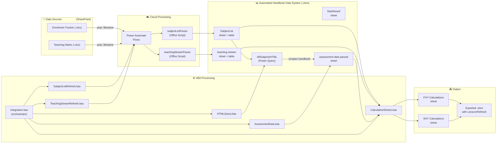

# Auto Handbook System

> Automated marking & admin support calculation system consolidation project for the Department of Management & Marketing, University of Melbourne.

## What It Does

This system **automatically saves 40+ hours of manual data collection per semester**, mitigates human errors, and eliminates the hassle of opening multiple documents by centralising all information in one place:

1. **Pulling subject enrolment data** from the department's Enrolment Tracker (SharePoint)
2. **Pulling teaching assignments** from the Teaching Matrix (SharePoint)
3. **Scraping assessment details** from the [University Handbook](https://handbook.unimelb.edu.au/) (web)
4. **Generating marking workload calculations** per subject, per study period
5. **Consolidating multiple documents** into a single source of truth with structured schemas and cell protection to ensure data integrity and facilitate team communication
6. **Exporting ready-to-use spreadsheets** with an expandable design for complex subjects and embedded refresh capabilities to pull updates for subject arrangements

---

## How It Works



The system pulls subject enrolment data and teaching assignments from SharePoint, scrapes assessment details from the [University Handbook](https://handbook.unimelb.edu.au/), and generates ready-to-use marking workload calculation spreadsheets — all triggered by a single button click.

---

## Tech Stack

| Layer | Technology |
|-------|----------:|
| Data Sources | SharePoint Online (Excel files) |
| Cloud Automation | Power Automate (HTTP-triggered flows) |
| Data Parsing | Office Scripts (TypeScript, runs in Excel Online) |
| Web Scraping | Power Query (M language, fetches HTML from the University's handbook) |
| Processing & Generation | VBA (Excel macros, cross-platform Mac/Windows) |
| Output | Excel workbook (.xlsm) with embedded VBA |

---

## Quick Start

1. Open the **Automated Handbook Data System.xlsm** workbook on SharePoint
2. Go to the **Dashboard** sheet
3. Fill in the required parameters (Year, Enrolment Tracker filename, etc.)
4. Click the **Run** button (triggers `Integration.bas` VBA module)
5. Wait for all steps to complete (~5–10 minutes)
6. Find the exported calculation file in the same SharePoint folder, or check for email notification

> For detailed instructions, see the [User Guide](docs/USER_GUIDE.md).

---

## Repository Structure

```
auto-handbook-system/
├── README.md                              ← You are here
├── LICENSE
├── docs/
│   ├── DESIGN_DOC.md                     ← Problem, design decisions, tradeoffs, impact
│   ├── DEVELOPER_GUIDE.md                ← Architecture, modules, data flow, troubleshooting
│   └── USER_GUIDE.md                     ← Data sources, maintenance, column reference
├── src/
│   ├── VBA modules/
│   │   ├── Integration.bas               ← Main orchestrator
│   │   ├── SubjectListRefresh.bas        ← Trigger subject list workflow
│   │   ├── TeachingStreamRefresh.bas     ← Trigger teaching stream workflow
│   │   ├── HTMLQuery.bas                 ← Refresh & format Power Query table
│   │   ├── AssessmentData.bas            ← Parse HTML assessment data
│   │   ├── CalculationSheets.bas         ← Generate FHY/SHY calculation sheets
│   │   └── LecturerRefresh.bas           ← Refresh lecturer data in exported file
│   ├── office scripts/
│   │   ├── subjectListParser.osts        ← Parse enrolment tracker → SubjectList table
│   │   └── teachingStreamParser.osts     ← Parse teaching matrix → teaching stream table
│   ├── power query/
│   │   └── AllSubjectsHTML               ← Fetch assessment HTML from handbook
│   └── power automate flows/
│       ├── WORKFLOW_RUNDOWN.md           ← Flow documentation & step-by-step walkthrough
│       ├── subjectlist.json              ← Subject list flow definition
│       ├── teachingstream.json           ← Teaching stream flow definition
│       ├── subject list workflow.png     ← Flow diagram screenshot
│       └── teaching stream workflow.png  ← Flow diagram screenshot
└── tests/
    ├── test-cases.md                     ← Manual test scenarios & verification steps
    └── golden-outputs/                   ← Archived baseline outputs (2025, 2026)
```

---

## Documentation Guide

| Document | Target Audience | What You'll Find |
|----------|----------|-----------------|
| 📋 [Design Doc](docs/DESIGN_DOC.md) | Stakeholders, hiring managers | Problem statement, design decisions, tradeoffs, measurable impact |
| 👤 [User Guide](docs/USER_GUIDE.md) | Team members (non-technical) | Step-by-step instructions, data sources, troubleshooting |
| 🔧 [Developer Guide](docs/DEVELOPER_GUIDE.md) | Maintainers, developers | Architecture, module reference, cell references, cross-platform notes |
| 🧪 [Test Cases](tests/test-cases.md) | QA, verification | Manual test scenarios, archived output baselines |

---

## License

[MIT](LICENSE)