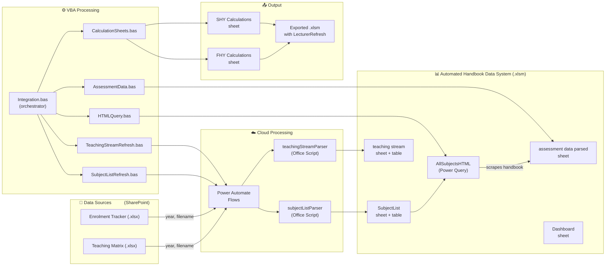

# Auto Handbook System

> Automated marking & admin support calculation engine for the Department of Management & Marketing, University of Melbourne.

## What It Does

This system **automatically saves 40+ hours of manual data collection per semester**, mitigates human errors, and eliminates the hassle of opening multiple documents by centralising all information in one place:

1. **Pulling subject enrolment data** from the department's Enrolment Tracker (SharePoint)
2. **Pulling teaching assignments** from the Teaching Matrix (SharePoint)
3. **Scraping assessment details** from the [University Handbook](https://handbook.unimelb.edu.au/) (web)
4. **Generating marking workload calculations** per subject, per study period
5. **Consolidating multiple documents** into a single source of truth with structured schemas and cell protection to ensure data integrity and facilitate team communication
6. **Exporting ready-to-use spreadsheets** with an expandable design for complex subjects and embedded refresh capabilities to pull updates for subject arrangements

---

## System Architecture



## Key Results (OKR)

| Objective | Key Result |
|-----------|-----------|
| **Automate semester workload calculations** | Reduce manual data collection from ~40 hrs → <10 min per run |
| **Eliminate data entry errors** | 100% of subject/assessment data sourced programmatically |
| **Enable mid-semester updates** | Lecturer data refreshable via one-click button in exported file |
| **Cross-platform compatibility** | Works on both Mac and Windows |
| **Self-service for team** | Non-technical users can maintain data sources and trigger runs |

## Impact

- **Time saved**: ~40 hours per semester × 2 semesters = **80 hours/year** of manual work automated and multiple working documents consolidated
- **Accuracy**: Eliminates transcription errors from manual data entry across 150+ subjects
- **Versality**: Lecturer assignments can be refreshed in the exported file at any time, not just at generation
- **Scalability**: Adding subjects/study periods requires zero code changes — just update the source spreadsheets

## Tech Stack

| Layer | Technology |
|-------|-----------:|
| Data Sources | SharePoint Online (Excel files) |
| Cloud Automation | Power Automate (HTTP-triggered flows) |
| Data Parsing | Office Scripts (TypeScript, runs in Excel Online) |
| Web Scraping | Power Query (M language, fetches HTML from the University's handbook) |
| Processing & Generation | VBA (Excel macros, cross-platform Mac/Windows) |
| Output | Excel workbook (.xlsm) with embedded VBA |

## Repository Structure

```
auto-handbook-system/
├── README.md                              ← You are here (project overview)
├── LICENSE
├── docs/
│   ├── DEVELOPER_GUIDE.md                 ← Architecture, modules, data flow, troubleshooting
│   └── USER_GUIDE.md                      ← Data sources, maintenance, column reference
├── src/
│   ├── VBA modules/
│   │   ├── Integration.bas                ← Main orchestrator
│   │   ├── SubjectListRefresh.bas         ← Trigger subject list workflow
│   │   ├── TeachingStreamRefresh.bas      ← Trigger teaching stream workflow
│   │   ├── HTMLQuery.bas                  ← Refresh & format Power Query table
│   │   ├── AssessmentData.bas             ← Parse HTML assessment data
│   │   ├── CalculationSheets.bas          ← Generate FHY/SHY calculation sheets
│   │   └── LecturerRefresh.bas            ← Refresh lecturer data in exported file
│   ├── office scripts/
│   │   ├── subjectListParser.osts         ← Parse enrolment tracker → SubjectList table
│   │   └── teachingStreamParser.osts      ← Parse teaching matrix → teaching stream table
│   ├── power query/
│   │   └── AllSubjectsHTML                ← Fetch assessment HTML from handbook
│   └── power automate flows/
│       ├── WORKFLOW_RUNDOWN.md            ← Flow documentation & step-by-step walkthrough
│       ├── subjectlist.json               ← Subject list flow definition
│       ├── teachingstream.json            ← Teaching stream flow definition
│       ├── subject list workflow.png      ← Flow diagram screenshot
│       └── teaching stream workflow.png   ← Flow diagram screenshot
└── tests/
    └── test-cases.md
```

## Quick Start

1. Open the **Automated Handbook Data System.xlsm** workbook on SharePoint
2. Go to the **Dashboard** sheet
3. Fill in the required parameters (Year, Enrolment Tracker filename, etc.)
4. Click the **Run** button (triggers `Integration.bas` VBA module)
5. Wait for all steps to complete (~5–10 minutes)
6. Find the exported calculation file in the same SharePoint folder, or check for email notification

> For detailed instructions, see the [User Guide](docs/USER_GUIDE.md).
> For development and maintenance, see the [Developer Guide](docs/DEVELOPER_GUIDE.md).