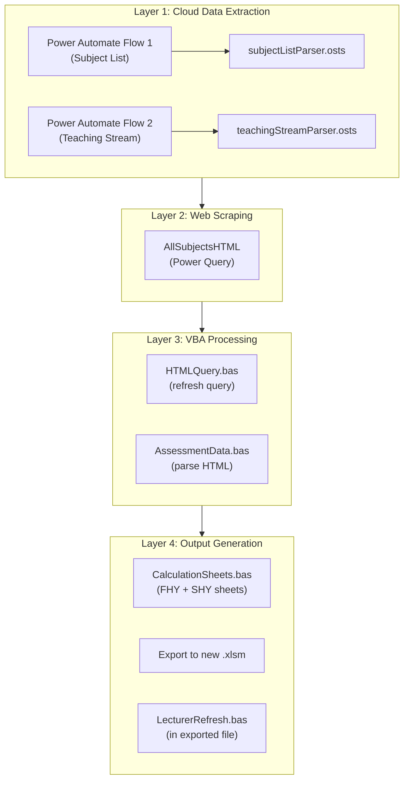

# Design Document — Auto Handbook System

> A narrative design document for the Automated Marking & Admin Support Calculation System, Department of Management & Marketing, University of Melbourne.

---

## Table of Contents

- [Background & Problem Statement](#background--problem-statement)
- [Objectives & Impact](#objectives--impact)
- [Technical Requirements](#technical-requirements)
- [System Architecture & Design Decisions](#system-architecture--design-decisions)
- [Execution Plan](#execution-plan)
- [Future Considerations](#future-considerations)

---

## Background & Problem Statement

### The Problem

Each semester, the Department of Management & Marketing administers **150+ subjects** across multiple study periods (Semester 1, Semester 2, Summer Term, Winter Term). For each subject, an administrator must:

1. **Look up subject enrolments** from the Enrolment Tracker spreadsheet on SharePoint
2. **Look up teaching assignments** from the Teaching Matrix spreadsheet on SharePoint
3. **Visit the University Handbook website** to find each subject's assessment structure (number of assessments, word counts, exam durations, group sizes)
4. **Manually calculate marking workload** using department benchmarks (words/hour, exams/hour, hours/stream)
5. **Compile everything** into a calculation spreadsheet, per study period, with lecturer assignments and marker allocation blocks

This process takes **40+ hours per semester** and is repeated **twice per year**. It involves navigating between multiple documents, manually copying data, and performing repetitive calculations.

A compounding problem was the **lack of any structured schema** in the existing documents. Data was populated wherever seemed convenient at the time, with no consistent layout, no enforced column definitions, and no clear separation between input data, calculated fields, and working space. This made the spreadsheet difficult to interpret, easy to accidentally break, and created significant barriers to team communication — confusion about what data lived where, unclear ownership of fields, and missing data going unnoticed because there was no expectation of completeness.

### Why This Matters

- **Human error**: Manual transcription across 150+ subjects introduces data entry mistakes that affect workload calculations and budget allocation
- **Time cost**: 80+ hours/year spent on a process that is fundamentally mechanical
- **No data integrity**: Without a defined schema, data was scattered without structure — leading to confusion, missing information going unnoticed, and unclear ownership of fields across the team
- **Poor team communication**: Multiple people working from a document with no clear layout meant duplicated effort, conflicting edits, and difficulty onboarding new team members
- **Stale data**: Once compiled, the spreadsheet became a static snapshot — lecturer changes mid-semester required starting over or manual patching
- **Knowledge bottleneck**: The process required institutional knowledge of where to find each data source and how to interpret it, making it difficult to hand off

### Who Is Affected

| Stakeholder | Pain Point |
| ----------- | ---------- |
| Department administrator | Spends 40+ hrs/semester on manual data collection, calculations, and cross-referencing |
| Subject coordinators | Receive workload calculations that may contain transcription errors |
| Casual academic markers | Contract arrangements depend on accurate marking hour calculations |
| Department leadership | Resource allocation decisions rely on correct workload data |

---

## Objectives & Impact

### Key Results (OKRs)

| Objective | Key Result |
| --------- | ---------- |
| **Automate semester workload calculations** | Reduce manual data collection from ~40 hrs → <10 min per run |
| **Eliminate data entry errors** | 100% of subject/assessment data sourced programmatically |
| **Enable mid-semester updates** | Lecturer data refreshable via one-click button in exported file |
| **Cross-platform compatibility** | Works on both Mac and Windows |
| **Self-service for team** | Non-technical users can maintain data sources and trigger runs |

### Measurable Impact

| Metric | Before | After | Improvement |
| ------ | ------ | ----- | ----------- |
| **Time per run** | ~40 hours manual | <10 minutes automated | **99.6% reduction** |
| **Annual time saved** | 80+ hours/year (×2 semesters) | ~20 minutes/year | **80+ hours reclaimed** |
| **Data accuracy** | Manual transcription across 150+ subjects | 100% programmatic sourcing | **Eliminates human error** |
| **Mid-semester updates** | Re-do from scratch or manually patch | One-click Lecturer Refresh | **Minutes instead of hours** |
| **Onboarding** | Requires institutional knowledge of data sources | Fill in 3 fields, click Run | **Self-service for any team member** |
| **Scalability** | Linear effort increase with more subjects | Zero code changes for scaling up or rolling over to next academic years | **Effort-independent of scale** |

---

### Non-Technical Requirements

1. **A single button click** should produce a complete, ready-to-use calculation spreadsheet
2. **Non-technical team members** should be able to run the system independently without developer support
3. **Lecturer assignments should be refreshable** without re-running the entire pipeline (mid-semester updates are common)
4. **The system should work within existing infrastructure** — SharePoint, Excel, and Power Automate are already available and familiar to the team
5. **The output should be editable** — users need working columns for manual adjustments (marker allocation, notes, stream enrolments) alongside protected formula columns

## Technical Requirements

| Requirement | Detail |
| ----------- | ------ |
| **Cross-platform** | Runs on both Mac and Windows (team uses both) |
| **SharePoint integration** | Source files live on SharePoint; the system must read from and write to SharePoint-hosted Excel files |
| **Web scraping** | Assessment data must be scraped from `handbook.unimelb.edu.au` (no API available) |
| **Embedded in Excel** | Processing logic must live inside the workbook — no external scripts or applications to install |
| **Protected output** | Formula columns locked to prevent accidental edits; working columns unlocked for user input |
| **Exportable** | Output saved as a standalone `.xlsm` with embedded refresh capability |

---

## System Architecture & Design Decisions

### Architecture Overview

The system is a **4-layer data pipeline** that executes sequentially:

| Layer | What Happens |
| ----- | ------------ |
| **1. Cloud Data Extraction** | VBA triggers Power Automate flows → Office Scripts read SharePoint Excel files → write structured data to workbook tables |
| **2. Web Scraping** | Power Query fetches assessment HTML from `handbook.unimelb.edu.au` for every subject in the subject list |
| **3. VBA Data Processing** | VBA parses raw HTML into structured assessment records (name, word count, exam type, group size) |
| **4. Output Generation** | VBA cross-references all data sources, generates FHY/SHY calculation sheets, exports to standalone workbook with embedded lecturer refresh |

### Design Tradeoffs

| Decision | Chosen Approach | Alternative Considered | Rationale |
| -------- | --------------- | ---------------------- | --------- |
| **VBA over Python/Node** | VBA macros embedded in Excel | Standalone Python script | Users already work in Excel; no installation required; cross-platform macro support; output is naturally an Excel file |
| **Power Automate over direct API** | Cloud flows with HTTP triggers | SharePoint REST API calls from VBA | Avoids OAuth complexity; Office Scripts run server-side with full Excel API; team can inspect and maintain flows visually |
| **Power Query for web scraping** | M language query in Excel | VBA HTTP requests + string parsing | Native Excel integration; handles concurrent requests; results cached in a table; refresh is a single operation |
| **HTML string parsing over regex** | Delimiter-based string manipulation in VBA | Regular expressions or external parser | VBA has no native regex engine for complex HTML; handbook HTML structure is consistent enough for simple delimiter parsing |
| **Selective sheet protection** | Lock formula columns (A–J, Q–R), unlock working columns | Full lock or no protection | Balances data integrity (protected formulas and handbook data) with user flexibility (editable marker blocks, notes, stream enrolments) |
| **Polling-based workflow monitoring** | VBA polls Dashboard cells every 2s for "Done" signal | Webhook callback or event-driven | VBA has no async/event model for external HTTP; polling is simple, reliable, and self-contained within the workbook |
| **Embedded LecturerRefresh in export** | VBA module copied into exported workbook | Require users to re-run full pipeline | Enables mid-semester lecturer updates without regenerating the entire spreadsheet; preserves user edits in marker blocks |

### Why Not a Web App or Cloud-Only Solution?

The team's workflow is **Excel-centric**. The Enrolment Tracker, Teaching Matrix, and all downstream outputs are Excel files on SharePoint. Building a web app would require:

- New infrastructure (hosting, authentication, database)
- User training on a new interface
- Migration of downstream workflows that consume the Excel output

The chosen approach meets users where they already are — inside Excel — with zero new tooling.

---

## Execution Plan

| Phase | Scope | Status |
| ----- | ----- | ------ |
| **Phase 1** | Subject list extraction — Power Automate flow + Office Script to parse Enrolment Tracker into `subject_list` table | ✓ |
| **Phase 2** | Teaching stream extraction — Power Automate flow + Office Script to parse Teaching Matrix into `teaching_stream` table | ✓ |
| **Phase 3** | Assessment web scraping — Power Query to fetch handbook HTML; VBA to parse into structured assessment records | ✓ |
| **Phase 4** | Output generation — VBA to generate FHY/SHY calculation sheets with formulas, protection, and formatting | ✓ |
| **Phase 5** | Export & refresh — Export standalone `.xlsm` with embedded `LecturerRefresh.bas` for mid-semester updates | ✓ |
| **Phase 6** | Cross-platform support — Mac compatibility for all VBA modules (conditional compilation, AppleScript HTTP) | ✓ |
| **Phase 7** | Documentation — User Guide, Developer Guide, and this Design Document | ✓ |

---

## Future Considerations

| Opportunity | Description |
| ----------- | ----------- |
| **Scheduled automation** | Power Automate could trigger the entire pipeline on a schedule (e.g., start of each semester) rather than requiring a manual button click |
| **Historical trend analysis** | Archiving outputs across years could enable workload trend reporting (e.g., marking hours growth by subject area) |
