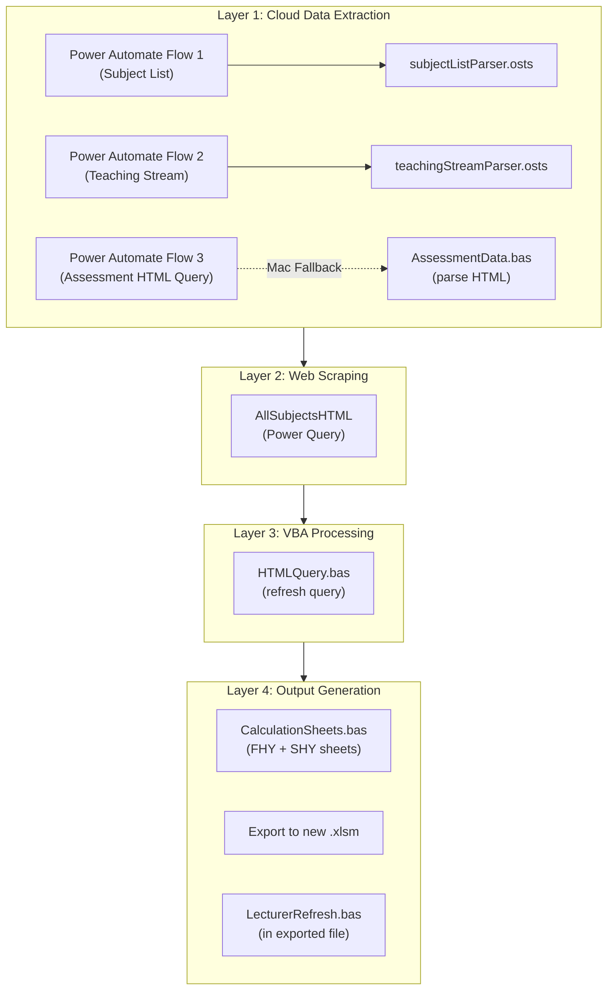

# Developer Guide

Technical reference for maintaining and extending the Auto Handbook System.

---

## Table of Contents

- [Architecture Overview](#architecture-overview)
- [Data Pipeline](#data-pipeline)
- [Module Reference](#module-reference)
- [Data Sources & Sheet Reference](#data-sources--sheet-reference)
- [Key Cell References](#key-cell-references)
- [Silent Mode](#silent-mode)
- [Cross-Platform Notes](#cross-platform-notes)
- [Troubleshooting](#troubleshooting)

---

## Architecture Overview

The system has **4 processing layers** that execute in sequence:

### Execution Order (Integrated Run)

When `GenerateMarkingSupport()` is called:

| Step | Module | What Happens |
| ---- | ------ | ------------ |
| 1 | `Integration.bas` | Sets `SilentMode = True`, reads Dashboard params, validates year |
| 2 | `SubjectListRefresh.bas` | HTTP POST to Power Automate → triggers `subjectListParser.osts` → populates `SubjectList` table |
| 3 | `TeachingStreamRefresh.bas` | HTTP POST to Power Automate → triggers `teachingStreamParser.osts` → populates `teaching_stream` table |
| 4 | `Integration.bas` | Monitors Dashboard F2 and F5 cells for "Done" (polling loop, 5s interval, 30min timeout) |
| 5 | `HTMLQuery.bas` | Refreshes `AllSubjectsHTML` Power Query table (fetches assessment format). **On Mac**: skips PQ, optionally triggers **Handbook Query Workflow** and monitors cell F3 |
| 6 | `AssessmentData.bas` | Parses HTML from `AllSubjectsHTML` → writes structured data to `assessment data parsed` sheet |
| 7 | `CalculationSheets.bas` | Generates `FHY Calculations` and `SHY Calculations` sheets, exports to new `.xlsm` with `LecturerRefresh.bas` embedded |
| 8 | `Integration.bas` | Sends email notification, sets `SilentMode = False` |

---

## Data Pipeline

### Layer 1: Cloud Data Extraction

**Power Automate Flows** are triggered via HTTP POST from VBA. Each flow:

1. Reads a SharePoint Excel file (Enrolment Tracker or Teaching Matrix)
2. Extracts relevant data as JSON
3. Passes JSON to an Office Script in the target workbook
4. The Office Script parses and writes data to the appropriate table
5. The Office Script writes `"Done"` to the `progress_bar` table as a completion signal

> **"Done" vs "Complete"**: `Done` = the Power Automate flow finished successfully. `Complete` = the VBA monitoring loop (`MonitorAndExecute`) detected the update and proceeded. If the Dashboard shows `Done` but the process stalls, the VBA polling may have timed out.

#### Flow 1: Subject List Refresh

| Property | Value |
| -------- | ----- |
| Trigger | HTTP POST from `SubjectListRefresh.bas` |
| Source | Enrolment Tracker (`.xlsx`) on SharePoint |
| Script | `subjectListParser.osts` |
| Target | `subject_list` table in `SubjectList` sheet |
| Status Cell | Dashboard `F2` |

**Payload**: `{ "year": 2026, "enrolmentTrackerFilename": "...", "email": "..." }`

#### Flow 2: Teaching Stream Refresh

| Property | Value |
| -------- | ----- |
| Trigger | HTTP POST from `TeachingStreamRefresh.bas` |
| Source | Teaching Matrix (`.xlsx`) on SharePoint — uses **two** Excel Online (Business) connections |
| Script | `teachingStreamParser.osts` |
| Target | `teaching_stream` table in `teaching stream` sheet |
| Status Cell | Dashboard `F5` |
| Pagination | Staff table reads up to **5000 rows** (Power Automate default limit) |

**Payload**: `{ "year": 2026, "teachingMatrixFilename": "...", "email": "..." }`

#### Flow 3: Assessment Query Workflow (Mac Fallback)

| Property | Value |
| -------- | ----- |
| Trigger | HTTP POST from `HTMLQuery.bas` (Mac only) |
| Source | Handbook Website (`https://handbook.unimelb.edu.au/`) |
| Script | Excel Online "Run script" action (inline/custom script to write rows) |
| Target | `AllSubjectsHTML` table in `AllSubjectsHTML` sheet |
| Status Cell | Dashboard `F3` |

**Payload**: `{ "year": 2026, "subjects": ["MGMT10001", "MKTG10001", ...] }`

### Layer 2: Web Scraping (Power Query)

The `AllSubjectsHTML` Power Query:

1. Reads subject codes from a `Parameters` table in the workbook
2. Constructs URLs: `https://handbook.unimelb.edu.au/{year}/subjects/{code}/assessment`
3. Fetches HTML for each subject
4. Extracts the `
` section
5. Stores results with status, HTML length, and fetch time

### Layer 3: VBA Data Processing

**HTMLQuery.bas** (`GenerateSubjectQueries`):

- **Mac**: Detects via `#If Mac Then`, skips refresh with user warning, formats existing data only
- **Windows**: Refreshes via `tbl.QueryTable` or targeted `wb.Connections` lookup (avoids `RefreshAll`)
- Formats columns, sets hyperlinks, applies table style
- Post-refresh status check: counts success/failed rows (shown only when run individually, suppressed by `SilentMode`)

**AssessmentData.bas** (`ParseAssessmentData`):

- Reads raw HTML from `AllSubjectsHTML` table
- Parses assessment details (name, word count, exam type, group size, quantity)
- Writes structured records to `assessment data parsed` sheet
- **In-class assessment detection**: `CheckIfInClass()` scans descriptions for keywords: `participation`, `presentation`, `attendance`, `pitch`, `online`, `ongoing`, `in class`. When matched, word count and exam duration are set to `0`

### Layer 4: Output Generation

**CalculationSheets.bas** (`GenerateCalculationSheets`):

- Filters subjects by grouped period (FHY/SHY) and exclusion rules
- Cross-references with assessment data and teaching stream data
- Generates calculation sheets with benchmarks (word count/hr, exams/hr, marking support hrs/stream)
- Exports to a new `.xlsm` workbook with `LecturerRefresh.bas` module embedded
- Adds "Refresh" buttons to the exported sheets
- **Sheet protection**: `Protect` is called with `AllowFormattingCells/Columns/Rows = True`, `AllowInsertingRows = False`, `AllowDeletingRows = False`, no password. Locked columns: **A–J** and **Q–R**

**Auto-exclusion rules** (applied by `subjectListParser.osts` during subject list generation):

- Subject code contains `FNCE`, `ACCT`, or `ECON`
- Subject name contains "indigenous" or "indigenising"
- Last 5 characters of subject code are not numeric
- Delivery mode contains "online" or "offshore"

---

## Module Reference

### Integration.bas (Orchestrator)

| Function | Purpose |
| -------- | ------- |
| `GenerateMarkingSupport()` | Main entry point. Sets SilentMode, validates params, triggers workflows, monitors, runs macros |
| `MonitorAndExecute()` | Polling loop that watches F2/F5 for completion, then calls `RunAllMacros` |
| `RunAllMacros()` | Sequential execution: HTMLQuery → AssessmentData → CalculationSheets |
| `ForceCloudSync()` | Saves workbook, refreshes all, forces recalculation (for SharePoint sync) |
| `CheckWorkflowComplete()` | Checks if a cell value is "DONE"/"COMPLETE"/"FINISHED" |
| `FinalizeProcess()` | Freezes elapsed time, sends email notification |
| `SendRequestMac()` / `SendRequestWindows()` | Platform-specific HTTP POST functions |
| `StopWorkflowMonitoring()` | User-callable macro to abort monitoring |
| `ResetStatus()` | Clears all status cells and resets state |

**Global Variables:**

- `Public SilentMode As Boolean` — suppresses MsgBox in sub-modules during integrated runs
- `Public StopMonitoring As Boolean` — flag to abort the monitoring loop
- `Public OriginalCalculationMode As XlCalculation` — saved calc mode for restoration

### SubjectListRefresh.bas

| Function | Purpose |
| -------- | ------- |
| `RefreshSubjectList()` | Standalone entry point (validates year, triggers workflow, shows MsgBox) |
| `TriggerSubjectListWorkflow()` | HTTP POST to Power Automate endpoint (called by Integration or standalone) |

### TeachingStreamRefresh.bas

| Function | Purpose |
| -------- | ------- |
| `RefreshTeachingStream()` | Standalone entry point |
| `TriggerTeachingStreamWorkflow()` | HTTP POST to Power Automate endpoint |

### HTMLQuery.bas

| Function | Purpose |
| -------- | ------- |
| `GenerateSubjectQueries()` | Mac detection → Power Automate workflow trigger (Mac) or Power Query refresh (Windows) → format → post-refresh status check |
| `FormatTableCleanup()` | Standardizes row heights, column widths, hyperlinks, table style |

### AssessmentData.bas

| Function | Purpose |
| -------- | ------- |
| `ParseAssessmentData()` | Main parser: reads HTML → writes structured assessment records |
| `SetupHeaders()` | Creates column headers on target sheet |
| `ExtractAssessmentDetails()` | Parses individual assessment entries from HTML |
| `FormatOutput()` | Applies formatting to the output sheet |

### CalculationSheets.bas

| Function | Purpose |
| -------- | ------- |
| `GenerateCalculationSheets()` | Main entry: creates FHY + SHY sheets, exports workbook |
| `GenerateSheet()` | Creates one calculation sheet (FHY or SHY) |
| `PopulateSheetData()` | Fills in subject data, assessments, formulas |
| `ExportCalculationSheets()` | Creates new workbook, copies sheets, embeds VBA, saves |
| `InitializeProcessLog()` | Creates "Process Log" sheet for real-time logging |
| `LogMessage()` | Writes timestamped messages to Process Log + Debug + StatusBar |
| `VerifyRequiredSheets()` | Checks that Dashboard, SubjectList, assessment data parsed, teaching stream all exist |

### LecturerRefresh.bas (Exported File Only)

| Function | Purpose |
| -------- | ------- |
| `RefreshLecturerData()` | Main entry: reads source params → triggers Teaching Matrix workflow → waits → updates lecturer columns |
| `GetSourceParameters()` | Opens source workbook read-only, reads C2/C5/C12 |
| `TriggerTeachingMatrixWorkflow()` | HTTP POST to Power Automate (Teaching Stream endpoint) |
| `WaitForTeachingMatrixWorkflowCompletion()` | Polls source Dashboard F5 every 3s (2min timeout) |
| `IdentifySubjectBlocks()` | Scans FHY/SHY Calculations for subject blocks by UID pattern |
| `UpdateAllLecturers()` | Refreshes columns L–O, preserves P–S user edits, inserts rows if needed |

> **Note**: This module lives in the **exported** calculation workbook, not the source workbook. It has its own copies of `SendRequestMac`, `SendRequestWindows`, and `EscapeJSON`.

---

## Data Sources & Sheet Reference

### Workbook Sheets

| Sheet Name | Table Name | Purpose | Created By |
| ---------- | ---------- | ------- | ---------- |
| `Dashboard` | `progress_bar`, `Parameters` | User inputs, status tracking, benchmarks | Manual |
| `SubjectList` | `subject_list` | Filtered subject data from Enrolment Tracker | `subjectListParser.osts` |
| `AllSubjectsHTML` | `AllSubjectsHTML` | Raw assessment HTML scraped from handbook | Power Query |
| `assessment data parsed` | *(range, not table)* | Structured assessment data parsed from HTML | `AssessmentData.bas` |
| `teaching stream` | `teaching_stream` | Lecturer assignments from Teaching Matrix | `teachingStreamParser.osts` |
| `FHY Calculations` | *(generated)* | First-half year calculation sheet | `CalculationSheets.bas` |
| `SHY Calculations` | *(generated)* | Second-half year calculation sheet | `CalculationSheets.bas` |
| `Process Log` | *(generated)* | Timestamped execution log | `CalculationSheets.bas` |

### External SharePoint Files

| File | Location | Purpose |
| ---- | -------- | ------- |
| Enrolment Tracker (`.xlsx`) | `/TEACHING MATRIX & ENROLMENT TRACKER/` | Source of subject codes, names, coordinators, study periods |
| Teaching Matrix (`.xlsx`) | `/TEACHING MATRIX & ENROLMENT TRACKER/` | Source of lecturer assignments, activity codes, stream counts |
| Automated Handbook Data System (`.xlsm`) | `/TEACHING SUPPORT/Handbook (.../Auto Handbook System/` | The main workbook containing all the macros |

**SharePoint identifiers** (hardcoded in Power Automate flows):

| Item | Value |
| ---- | ----- |
| Site Group ID | `ad6c8e15-4773-48f0-a918-df5ce6b5a0ec` |
| Source files path | `/Shared Documents/TEACHING MATRIX & ENROLMENT TRACKER/` |
| Target workbook path | `/Shared Documents/TEACHING SUPPORT/Handbook (.../Auto Handbook System/Automated Handbook Data System.xlsm` |

### Required Table Names (Do Not Rename)

| File | Table Name | Used By |
| ---- | ---------- | ------- |
| Enrolment Tracker | `Enrolment_Tracker` | Subject List flow (Power Automate) |
| Enrolment Tracker | `Enrolment_Number` | Calculation sheet formulas (external workbook link for enrolment count) |
| Teaching Matrix | `Teaching_Data` | Teaching Stream flow (Power Automate) |
| Teaching Matrix | `Staff_table` | Teaching Stream flow (Power Automate) |
| Source workbook | `progress_bar` | Both flows (completion signal) |
| Source workbook | `subject_list` | `CalculationSheets.bas`, `HTMLQuery.bas` |
| Source workbook | `AllSubjectsHTML` | `HTMLQuery.bas`, `AssessmentData.bas` |
| Source workbook | `teaching_stream` | `CalculationSheets.bas`, `LecturerRefresh.bas` |

### Column Header Matching

The Office Scripts match column headers using **keyword-contains** (case-insensitive, whitespace-normalised). For example, a header `"Subject Code DO NOT SORT"` matches the keyword `"Subject Code"`. Avoid renaming or restructuring headers — the scripts are tolerant of extra text and line breaks, but not of missing keywords.

---

## Key Cell References

### Dashboard Sheet

| Cell | Purpose | Used By |
| ---- | ------- | ------- |
| `C2` | **Year** (e.g., 2026) — used in all workflows and handbook URLs | All modules |
| `C3` | Enrolment Tracker filename (optional override) | `SubjectListRefresh.bas` |
| `C5` | Teaching Matrix filename (optional override) | `TeachingStreamRefresh.bas` |
| `C8` | Word count benchmark (words/hr) | `CalculationSheets.bas` |
| `C9` | Exam benchmark (exams/hr) | `CalculationSheets.bas` |
| `C10` | Marking support benchmark (hrs/stream) | `CalculationSheets.bas` |
| `C12` | Email address for completion notification | `Integration.bas` |
| `C15` | Last run date (auto-filled) | `Integration.bas` |
| `C16` | Last run start time (auto-filled) | `Integration.bas` |
| `C17` | Elapsed time (formula, then frozen) | `Integration.bas` |
| `F2` | **Subject List Refresh status** (monitored for "Done") | `Integration.bas`, `subjectListParser.osts` |
| `F3` | GenerateSubjectQueries status (shows **Skipped** on Mac) | `Integration.bas` |
| `F4` | ParseAssessmentData status | `Integration.bas` |
| `F5` | **Teaching Stream Refresh status** (monitored for "Done") | `Integration.bas`, `teachingStreamParser.osts` |
| `F6` | GenerateCalculationSheets status | `Integration.bas` |

### Calculation Sheet Columns (FHY/SHY)

| Col | Letter | Header |
| --- | ------ | ------ |
| 1 | A | UID (hidden) |
| 2 | B | Subject Code |
| 3 | C | Study Period |
| 4 | D | Enrolment |
| 5 | E | Assessment Details |
| 6 | F | Word Count |
| 7 | G | Exam |
| 8 | H | Group Size |
| 9 | I | Assessment Quantity |
| 10 | J | Marking Hours |
| 11 | K | Assessment Notes |
| 12 | L | Lecturer/Instructors |
| 13 | M | Status |
| 14 | N | Stream # |
| 15 | O | Activity Code |
| 16 | P | Stream(s) Enrolment |
| 17 | Q | Allocated Marking |
| 18 | R | Marking Support Hours Available |
| 19 | S | Lecturer Notes |
| 20–29 | T–AC | Marker 1 block — all editable (Name, Assessment Details, Word Count, Exam, Group Size, Assessment Quantity, Marking Allocation, Email, Arrangement Notes, Contract Requested) |
| 30–39 | AD–AM | Marker 2 block (same structure) |
| 40–49 | AN–AW | Marker 3 block (same structure) |

> **Locked columns**: A–J and Q–R only. All marker block columns (T–AW) are **unlocked** — users can overwrite formulas to create custom marking arrangements.
>
> **LecturerRefresh** updates columns **L–O** only and preserves **P–S** (user edits).

---

## Silent Mode

The `SilentMode` global variable controls whether `MsgBox` calls are displayed:

- **`SilentMode = True`**: Set at the start of `GenerateMarkingSupport()`. All sub-module MsgBox calls are suppressed.
- **`SilentMode = False`**: Set when the process completes or is stopped.
- **Individual runs**: When running a module standalone (e.g., `GenerateCalculationSheets` directly), `SilentMode` defaults to `False`, so all MsgBox dialogs appear normally.

### Modules with SilentMode guards

| Module | MsgBox Count Guarded |
| ------ | -------------------- |
| `AssessmentData.bas` | 1 |
| `HTMLQuery.bas` | 5 (includes Mac warning + post-refresh status) |
| `CalculationSheets.bas` | 11 |

---

## Cross-Platform Notes

The system supports both **Mac** and **Windows**:

- **Power Query** (AllSubjectsHTML refresh) is **Windows-only**. On Mac, the system triggers a **Power Automate HTML download workflow** as a cloud-side fallback (polls Dashboard F3 for completion, 5-minute timeout). The user can opt to skip and use existing data instead.
- HTTP requests use `#If Mac Then` conditional compilation
  - Mac: `MacScript("do shell script ""curl ...""")` via AppleScript
  - Windows: `MSXML2.XMLHTTP` / `MSXML2.ServerXMLHTTP` COM objects
- `Integration.bas` monitors F3 status during integrated runs. On Mac, F3 shows **"Running..."** during the cloud workflow, **"Complete"** when done, **"Timeout"** if the 5-minute poll expires, or **"Skipped"** (grey) if the user opts out
- Path separators handled via `Application.PathSeparator`
- `LecturerRefresh.bas` uses Mac-compatible 2D arrays instead of Collections for return types

---

## Troubleshooting

### Power Automate flow doesn't trigger

1. Check network connectivity
2. Verify the API URL hasn't been regenerated (check `SubjectListRefresh.bas` and `TeachingStreamRefresh.bas` for hardcoded URLs)
3. Ensure the year in `C2` is valid (≥ 2025)
4. Check if the Power Automate flow is turned on in the Power Automate portal

### Monitoring times out (30 minutes)

1. Check if the Power Automate flow ran successfully in the portal
2. Verify the Office Script updated `F2`/`F5` to "Done" on the Dashboard
3. The `progress_bar` table may not have a matching row for "Subject List" or "Teaching Stream"
4. Cloud sync issues — SharePoint may not be pushing updates to the local workbook

### Power Query returns errors / all "Failed" status

1. Verify `C2` (Year) is correct — handbook URLs are built with this year
2. Check if `https://handbook.unimelb.edu.au/{year}/subjects/` is accessible
3. If all subjects fail, the year may not yet be published on the handbook
4. The `Parameters` table (read by Power Query) must have the correct subject codes

### Calculation sheets not generated

1. Check the **Process Log** sheet for error details
2. Verify all required sheets exist: `Dashboard`, `SubjectList`, `assessment data parsed`, `teaching stream`
3. Check benchmark values in `C8`, `C9`, `C10` are positive numbers
4. Ensure no sheets are protected or locked

### LecturerRefresh fails in exported file

1. The source workbook path is hardcoded in `LecturerRefresh.bas` (line 23) — if the SharePoint folder moves, update it
2. The source workbook must be accessible (not locked by another user)
3. Teaching Matrix workflow timeout is 2 minutes — if the Teaching Matrix is very large, increase `maxWaitSeconds` in `WaitForTeachingMatrixWorkflowCompletion`

### MsgBox dialogs appear during integrated run

1. A module may have an unguarded `MsgBox` call — check that `If Not SilentMode Then` wraps it
2. `SilentMode` is declared in `Integration.bas` — other modules reference it as a Public global
3. If running from the exported file, `SilentMode` doesn't exist (only in source workbook)

### Export saves to wrong location

1. The export path is based on `ThisWorkbook.Path` — when running from SharePoint, this resolves to the cloud path
2. If the save fails, it falls back to `Application.DefaultFilePath` (usually Documents)
3. Check the Process Log for the exact save path used
